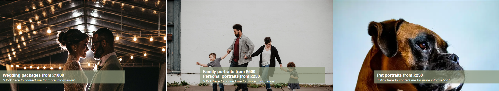
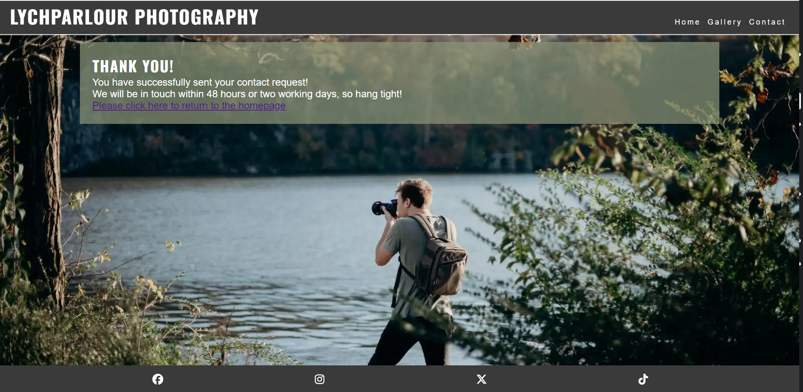

# ***LychParlour Photography***

LychParlour photography is designed to be a responsive site that will allow visitors to view the portfolio, find out about recent works, follow social media pages and contact with potential job opportunities.

The target visitors to this sight are:

- Photography enthusiasts
- Potential clients
- Event planners
- Media agencies

---

## ***Contents***

- [***LychParlour Photography***](#lychparlour-photography)
  - [***Contents***](#contents)
  - [***User Experience*** (UX)](#user-experience-ux)
  - [**User Aims**](#user-aims)
    - [*Visitor Goals*](#visitor-goals)
    - [*First Time Visitor Goals*](#first-time-visitor-goals)
    - [*Returning Visitor Goals*](#returning-visitor-goals)
  - [***User Experience Design (UXD)***](#user-experience-design-uxd)
    - [*Colour Scheme*](#colour-scheme)
    - [*Typography*](#typography)
    - [*image sourcing*](#image-sourcing)
  - [***Features***](#features)
    - [*General Features*](#general-features)
    - [Future Implementations](#future-implementations)
  - [Accessibility](#accessibility)
  - [Technologies Used](#technologies-used)
    - [Languages Used](#languages-used)
    - [Frameworks, Libraries \& Programs Used](#frameworks-libraries--programs-used)
  - [Deployment](#deployment)
    - [Deployment](#deployment-1)
    - [Local Development](#local-development)
    - [How to Fork](#how-to-fork)
    - [How to Clone](#how-to-clone)
  - [Testing](#testing)
  - [Credits](#credits)
    - [Content](#content)
    - [Media](#media)

---

## ***User Experience*** (UX)

LychParlour Photographary is an online site dedicated to captivating wolrd of LychParlour -  a digital haven where moments become timeless masterpieces. Calls to action throughout the site allow visitors to explore and contact the photographer.
There are opportunities to view the current portfolio in the gallery page which feels like strolling through an art gallery, each image telling a unique story. For those wanting to know more, there is a short section describing the photographer's story and style on the landing page with links to social media sites in the footer, so visitors may be able to keep up to date with current and upcoming projects.
The contact form on the contact me page is designed for the visitors who would like to enquire about detailed pricing, bookings and collaboration.

## **User Aims**

### *Visitor Goals*

The overall Goals for visitors to the site is for them to gain inspiration for upcoming events, potentially leading to hiring.
For fellow photgraphy enthusiasts and photgraphers to explore the gallery and to see potential for collaberation.
Finally for visitors to be drawn to certain pieces so they may want to purchase prints or hire the photographer for events.

### *First Time Visitor Goals*

The goals for first time visitors would be to make them feel initially welcomed to the site through pleasent user experience. The site with its easy navigation and photography display, sending out a clear message to the new visitor.  The visitor would get an insight into the ethos of the photographer, learning more about the journey to their style and values.  
To encourage first time visitors to contact the photographer with enquiries about potential work or prints, and finally wanting return to this site again and again.

### *Returning Visitor Goals*

The goals once visitors are returning to this site would be to encourage them to share this page with other new visitors.
To want to come to see updated portfolio highlights with new and captivating images, encouraging to explore the phototgrapher's evolving style and skill leadong to repeat hire. The returning visitors could also be drawn back to look for offers and deals.

---

## ***User Experience Design (UXD)***

Websites are designed to be accessible for all. LychParlour Photography has been designed in a way to be accesssible.

Layout decisions, colour scheme, fonts and details are suitable for screen readers to assist people with visual impairments, allowing them to enjoy this site.

### *Colour Scheme*

The colour scheme chosen for this site is made up of three simple colours. This was to keep consistency throughout the site but the colours were also chosen for specific reasons.

The dark grey was used for the header and footer to create a border abound the site, aiming to draw the visitors eyes more toward the centre.

White was used as the text font colour as it pops against darker shades making the text easy to read, and also points out useful and interesting information to the visitor.

The shade of green was chosen as an earth tone to match the ethos of the photographer. It is used to surround the text in the site so if a visitor sees the green they will also know there is text to read.

### *Typography*

The fonts used in the site were taken from Google fonts,

The fonts used were:

- Josefin sans
- Oswald fonts

The Oswald font is used for titles and pieces of writing that need to be impactful due to the bold, eye-catching nature of the font.
Josefin felt like it flowed and made the text look slightly less blocky, adding flow to the entire site.

### *Image Sourcing*

Images for this site were sourced from my own photographs and two websites:

- unsplash
- pexels

---

## ***Features***

### *General Features*

Website features are the many individual components that make up the site, making it easy to navigate, functional and valuable to visitors. LychParlour photography, like all other sites, include several features including: 

#### *Favicon*

The favicon is a small image that can be seen on the top left of the visitors tab when they have the site open.
It is used to mark the site if the visitor has multiple tabs open in their browser, allowing them to find LychParlour photography easily.
Please see the example of the LychPArlour photgraphy favicon:

#### *Logo & Navbar*

The logo is a symbol or text which identifies the site, this being the bold title in the header next to the navigational bar.
It is big, bold and of contarasting colour to the header background to stand out and to tell the visitor what site they are visiting, making it recognisable.

The website is comprised of three pages which are accessible from the navigation menu (Home, Gallery & Contact).
All Pages on the site have responsive navigation bar at the top which allows ease of movement through the site, with clear headingings so the visitor knows which page the navigation bar will take them too and also show what page they are currently on.

#### *Hero section*

A hero image is a large or oversized web banner image usually towards the top of the page. This prominent place makes the hero section often the first thing visitors see when arriving on the site. This gives them an idea on what the website is about and invites them look into the further content of the site.
Below is an image of the header and hero section:

#### *About Me Section*
This section is a view into the photographer's ethos, why they take the pictures, their style, and invites the visitor to get to know them better in hopes that the visitor would like to hire them or work with the photographer now in the future.
Below is a screenshot from the site showing the about me section:

#### *Call To Action*

A call to action is a prompt on a website that tells the visitor to take a specified action. On the LychParlour photography site this is the collection of three images at the bottom of the home page with clickable links on them. This is a request that allows the visitor to learn more about the photographer's services they can click the link or to contact them.
Below is a screenshot from the site showing the call to action images:

#### *Footer*

A footer is at the bottom of the page, usually includes important information such as a copyright notice for example. The LychParlour photography site footer contains social media icon links to facebook, Instagram, Twitter & TikTok,these open in new tabs so the visitor does not lose the original page.

#### *Gallery*

Having a gallery is a way of integrating images into a website, allowing visitors to see several images clearly at once.
LychParlour photography uses the gallery to show a portfolio of their work, this is to intrigue the visitor and encourage them to hire or collaborate with photographer.

#### *Contact*

This contact page gives the visitor a form to contact the photographer directly with any queries they may have.
The contact page is designed so that the visitor must fill out all sections of the form before they can send their query. This allows the photographer to have contact details so that they may reply to the visitors.
Below is a screenshot of the contact page from the site.

#### *Thank You Page*

This thank you page is a landing page from the contact form it is here so once the form is completed the visitor to the page can still navigate around the site.
Below is the screenshot of the thank you page.

#### *Error 404*

If a visitor tries typing in part of the LychParlour photography websites url and makes a mistake, they will be direceted to the error 404 page.
Error 404 is a status code meaning what the visitor had typed in could not be found.
The LychParlour 404 has a helpful link that will bring the visitor back to the home page so if they do go astray they can find their way back quickly.

### *Future Implementations*

In the future there are some improvements and other features that I would like to add to the website.
Firstly, a store area so that visitors would be able to make purchases directly through the site.
Next, a Newsletter and and membership area where repeat visitors would be able to sign up, keep up to date with the photolgrapher and be offered discounts.
Finally, an addition of some check boxes to the contact form so that the messages from visitors can be organised for an easier response by the photographer

---

## ***Accessibility***

I have been mindful during coding to ensure that the website is as accessible and friendly as possible. I have achieved this by:

- Using semantic HTML.
- Using descriptive alt attributes on images on the site.
- Ensuring that there is a sufficient colour contrast throughout the site.
- Ensuring menus are accessible by marking the current page as current for screen readers.

---

## ***Technologies Used***

### *Languages Used*

HTML and CSS were used to create this website.

### *Frameworks, Libraries & Programs Used*

- Github - To save and store the files for the website.

- Google Fonts - To import the fonts used on the website.

- Font Awesome - For the iconography on the website.

- Google Dev Tools - To troubleshoot and test features, solve issues with responsiveness and styling.

- Favicon.io - To create favicon.

---

## ***Deployment***

### *Deployment*

Github Pages were used to deploy the live website. The instructions to achieve this are:

 - Log in (or sign up) to Github.
 - Find the repository for this project, LychParlour-photography. 
 - Click on the Settings link. 
 - Click on the Pages link in the navigation bar on the left. 
 - In the Source section, choose main from the drop down select branch menu. 
 - Select Root from the drop down select folder menu. 
 - Click Save. 
 - Your live Github Pages site is now deployed at the URL shown.

With each new commit and git push the deployed site will update.

### *Local Development*
The local development section gives instructions on how someone else could make a copy of your project to use on their local machine. This section will get more complex in the later projects, and can be a great reference to yourself if you forget how to do this.

### *How to Fork*
To fork the LychParlour-photography repository:
- Log in (or sign up) to Github. 
- Go to the repository for this project, TommySpecs/LychParlour-photography. 
- Click the Fork button in the top right corner.

### *How to Clone*
To clone the LychParlour-photography repository: Starts the same way of how to fork the repository. 
- Log in (or sign up) to Github. 
- Go to the repository for this project, TommySpecs/LychParlour-photography. 
- Click on the code button, select whether you would like to clone with HTTPS, SSH or GitHub CLI and copy the link shown.
- Open the terminal in your code editor and change the current working directory to the location you want to use for the cloned directory.
- Type 'git clone' into the terminal and then paste the link that was copied. 
- Press enter.

---

## ***Testing***

[testing](https://github.com/TommySpecs/LychParlour-photography/blob/main/testing.md)

---

## ***Credits***

### *Content*

|URL| what it is | reason for use |
|---|---------------|----------------|
| https://tinypng.com/ | image compressor | used to compress images to lower file sizes and increase performance |
| https://cloudconvert.com/jpg-to-webp | image converter and resizer| Used to change image format to lower file sizes and increase performance|
| https://www.birme.net/?no_resize=true | image resizer | Used to change image sizes and increase performance|
| https://www.color-hex.com/ |  hex code finder | to find the correct hex code for the colours wanted to be used on the website |
| https://docs.gitlab.com/ee/topics/git/git_rebase.html |  Git commit fix | to fix issue when git commit stopped working|
| https://success.appen.com/hc/en-us/articles/202703155-CSS-Guide-to-Enlarge-Images-on-Hover |  Gallery image enlarge code| Used to add functionality to the page|
| https://www.shecodes.io/athena/8356-align-images-horizontally-with-equal-space-in-html-css#:~:text=By%20setting%20the%20parent%20element,And%20that's%20it | aligning images on index page | Used to ensure the call to action images were aligned correctly|
| https://developer.mozilla.org/en-US/docs/Web/CSS/CSS_backgrounds_and_borders/Resizing_background_images | resizing background image   | fixing background image on contact page | 
|  https://www.w3.org/TR/html401/present/graphics.html#:~:text=It%20is%20possible%20to%20achieve,%22mypar%22%3E... | code for text in P elements| to add some intrigue in my P elements|
|https://learn.codeinstitute.net/courses/course-v1:CodeInstitute+LRFX101+2023_Q2/courseware/e805068059af42af87681032aa64053f/1da6ad13213740f1855a51d30a2375b1/ | Love Running Project example| Used to help create the barebones of the website|
|https://css-tricks.com/inclusively-hidden/ | inclusively hidden | used to try to fix the error message in the WAVE tests|

### *Media*
https://unsplash.com/ 

https://www.pexels.com/ 

https://coolors.co/ - used to generate the palette for the README.md doc

|Image name | Source|
|-----------|-------|
|boxer | provided by myself|
|broken-camera | christian-bolt-_IR0185tRzA-unsplash|
|cuddle-puppy | pexels-helena-lopes-1378849 |
|duck | provided by myself|
|family1 | pexels-emma-bauso-2253879 |
|family2 | pexels-ksenia-chernaya-3730990 |
|female-headshot | pexels-becca-correia-3770254|
|field-of-grass | aaron-burden-yzgF-AQt1sQ-unsplash|
|flower1  |provided by myself|
|flower2 | provided by myself|
|Frenchie | pexels-pixabay-160846|
|Hero1 | gabe-hobbs-Py3wHdjMaAI-unsplash|
|Hero2 | nathan-anderson-04OtkxJTQR4-unsplash|
|Holding-hands | danie-franco-7XqL_DVuBMw-unsplash|
|Lion- pexels | ardit-mbrati-14659604|
|Male-headshot | pexels-monstera-production-5384445|
|Moorhen | provided by myself|
| Moss  | provided by myself|
| Robin | provided by myself|
|Tree-in-puddle | provided by myself |
|Wedding-table | aaron-burden-yzgF-AQt1sQ-unsplash |
|Wedding1 | pexels-jonathan-borba-3014856 |
|Wedding2 | pexels-wallace-araujo-3491999 |
|Wolf | pexels-pixabay-2361 |
