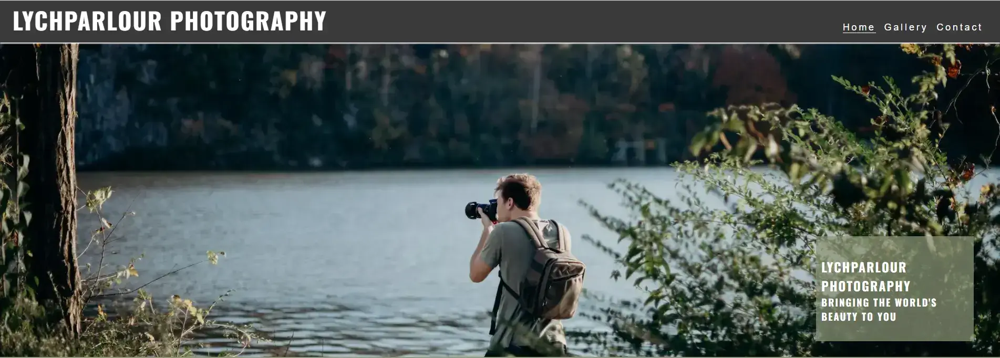

# ***LychParlour Photography***

LychParlour photography is designed to be a responsive site that will allow visitors to view the portfolio, find out about recent works, follow social media pages and contact with potential job opportunities.

The target visitors to this sight are:

- Photography enthusiasts
- Potential clients
- Event planners
- Media agencies

---

## ***Contents***

- [***LychParlour Photography***](#lychparlour-photography)
  - [***Contents***](#contents)
  - [***User Experience*** (UX)](#user-experience-ux)
  - [**User Aims**](#user-aims)
    - [*Visitor Goals*](#visitor-goals)
    - [*First Time Visitor Goals*](#first-time-visitor-goals)
    - [*Returning Visitor Goals*](#returning-visitor-goals)
  - [***User Experience Design (UXD)***](#user-experience-design-uxd)
    - [*Colour Scheme*](#colour-scheme)
    - [*Typography*](#typography)
    - [*image sourcing*](#image-sourcing)
  - [***Features***](#features)
    - [*General Features*](#general-features)
    - [Future Implementations](#future-implementations)
  - [Accessibility](#accessibility)
  - [Technologies Used](#technologies-used)
    - [Languages Used](#languages-used)
    - [Frameworks, Libraries \& Programs Used](#frameworks-libraries--programs-used)
  - [Deployment](#deployment)
    - [Deployment](#deployment-1)
    - [Local Development](#local-development)
    - [How to Fork](#how-to-fork)
    - [How to Clone](#how-to-clone)
  - [Testing](#testing)
  - [Credits](#credits)
    - [Content](#content)
    - [Media](#media)

---

## ***User Experience*** (UX)

LychParlour Photographary is an online site dedicated to captivating wolrd of LychParlour -  a digital haven where moments become timeless masterpieces. Calls to action throughout the site allow visitors to explore and contact the photographer.
There are opportunities to view the current portfolio in the gallery page which feels like strolling through an art gallery, each image telling a unique story. For those wanting to know more, there is a short section describing the photographer's story and style on the landing page with links to social media sites in the footer, so visitors may be able to keep up to date with current and upcoming projects.
The contact form on the contact me page is designed for the visitors who would like to enquire about detailed pricing, bookings and collaboration.

## **User Aims**

### *Visitor Goals*

The overall Goals for visitors to the site is for them to gain inspiration for upcoming events, potentially leading to hiring.
For fellow photgraphy enthusiasts and photgraphers to explore the gallery and to see potential for collaberation.
Finally for visitors to be drawn to certain pieces so they may want to purchase prints or hire the photographer for events.

### *First Time Visitor Goals*

The goals for first time visitors would be to make them feel initially welcomed to the site through pleasent user experience. The site with its easy navigation and photography display, sending out a clear message to the new visitor.  The visitor would get an insight into the ethos of the photographer, learning more about the journey to their style and values.  
To encourage first time visitors to contact the photographer with enquiries about potential work or prints, and finally wanting return to this site again and again.

### *Returning Visitor Goals*

The goals once visitors are returning to this site would be to encourage them to share this page with other new visitors.
To want to come to see updated portfolio highlights with new and captivating images, encouraging to explore the phototgrapher's evolving style and skill leadong to repeat hire. The returning visitors could also be drawn back to look for offers and deals.

---

## ***User Experience Design (UXD)***

Websites are designed to be accessible for all. LychParlour Photography has been looked at and designed in a way to be accesssible.

This is from layout decisions colour schemes, chosen fonts and adding details for screen readers to assits even the visually impaired to enjoy this site.

### *Colour Scheme*

The colour scheme chosen for this site is made up of three simple colours. This was to keep consistency through out the site but the colours were also chosen for specific reasons.

The dark grey was used for the header and footer to create a border abound the site, aiming to draw the visitors eyes more central.

White was used as the text font colour as it pops against darker shades making the text easy to read and also poijnts out to the visitor that there is information for them to read.

The shade of green was chosen as it is a very earth tne colour, to match with the ethos of the photographer. It is used to surround the text in the site so if a visitor sees the green they will also know there is text for them to read.

### *Typography*

The fonts used in the site were taken from Google fonts,

The fonts used were:

- Josefin sans
- Oswald fonts

The Oswald font is used for titles and pieces of writting that need to be impactful due to the bold, eyecatching nature of the font.
Where as Josefin felt like it flowed nicer and made the text look slightly less blocky and felt it gave flow to the site.

### *image sourcing*

Images for this site were sourced from my own photographs and two websites:

- unsplash
- pexels

---

## ***Features***

### *General Features*

The website is comprised of three pages which are accessible from the navigation menu (Home, Gallery & Contact).
All Pages on the website have responsive navigation bar at the top which allows ease of movement through the site, with clear headingings so the visitor knows which page the navigation bar will take them too and also show what page they are currently on.

favicon

logo
navbar 
hero image
hero text

About Us Section

call to action

A footer which contains social media icon links to facebook, Instagram, Twitter & TikTok. Icons were used to keep the footer clean and because they are universally recognisable.

Gallery

Contact

thank you page

404

### Future Implementations

---

## Accessibility

I have been mindful during coding to ensure that the website is as accessible friendly as possible. I have achieved this by:

Using semantic HTML.
Using descriptive alt attributes on images on the site.
Ensuring that there is a sufficient colour contrast throughout the site.
Ensuring menus are accessible by marking the current page as current for screen readers.

---

## Technologies Used

### Languages Used

HTML and CSS were used to create this website.

### Frameworks, Libraries & Programs Used

Github - To save and store the files for the website.

Google Fonts - To import the fonts used on the website.

Font Awesome - For the iconography on the website.

Google Dev Tools - To troubleshoot and test features, solve issues with responsiveness and styling.

Favicon.io - To create favicon.

---

## Deployment

### Deployment

Github Pages was used to deploy the live website. The instructions to achieve this are below:

Log in (or sign up) to Github. Find the repository for this project, LychParlour-photography. Click on the Settings link. Click on the Pages link in the left hand side navigation bar. In the Source section, choose main from the drop down select branch menu. Select Root from the drop down select folder menu. Click Save. Your live Github Pages site is now deployed at the URL shown.

### Local Development
The local development section gives instructions on how someone else could make a copy of your project to play with on their local machine. This section will get more complex in the later projects, and can be a great reference to yourself if you forget how to do this.

### How to Fork
To fork the LychParlour-photographyrepository:

Log in (or sign up) to Github. Go to the repository for this project, TommySpecs/LychParlour-photography. Click the Fork button in the top right corner.

### How to Clone
To clone the LychParlour-photography repository:

Log in (or sign up) to GitHub. Go to the repository for this project, TommySpecs/LychParlour-photograph. Click on the code button, select whether you would like to clone with HTTPS, SSH or GitHub CLI and copy the link shown. Open the terminal in your code editor and change the current working directory to the location you want to use for the cloned directory. Type 'git clone' into the terminal and then paste the link you copied in step 3. Press enter.

---

## Testing

-link to testing.md

---

## Credits

### Content

Love Running

### Media
