# Project 1 - LychParlour-photgraphy TESTING

## Contents
- [Automated Testing](#automated-testing)
- [Manual Testing](#manual-testing)
- [Bugs](#bugs)

## Automated Testing

### W3C Validator
####  *HTML*

W3C was used to validate the HTML on all pages of the LychParlour photography website. I  checked the HTML via direct input and also by copying the page source and running these through the validator.

- Index - No errors or warnings.

- Gallery -No errors or warnings.

- Contact - No errors or warnings.

- Thank you - No errors or warnings.

- 404 - No errors or warnings.

##### Index
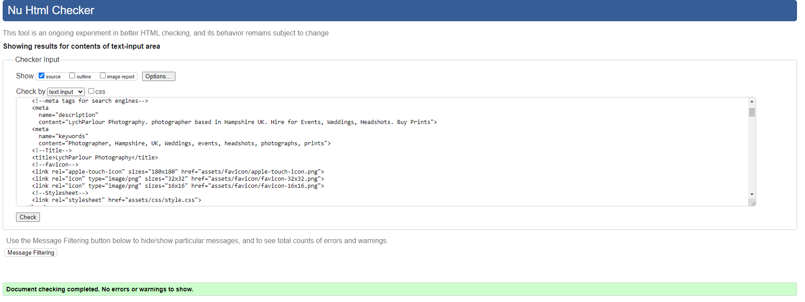

##### Gallery
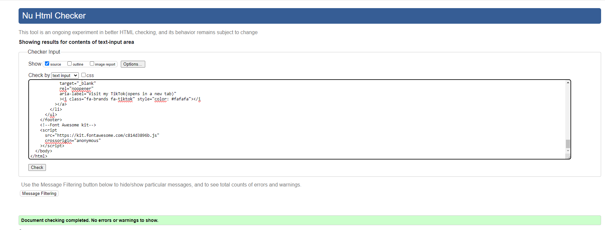

##### Contact
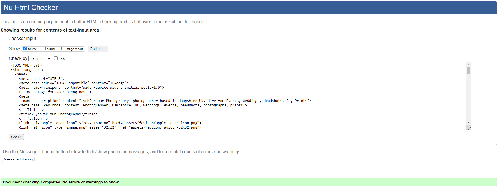

##### Thank You
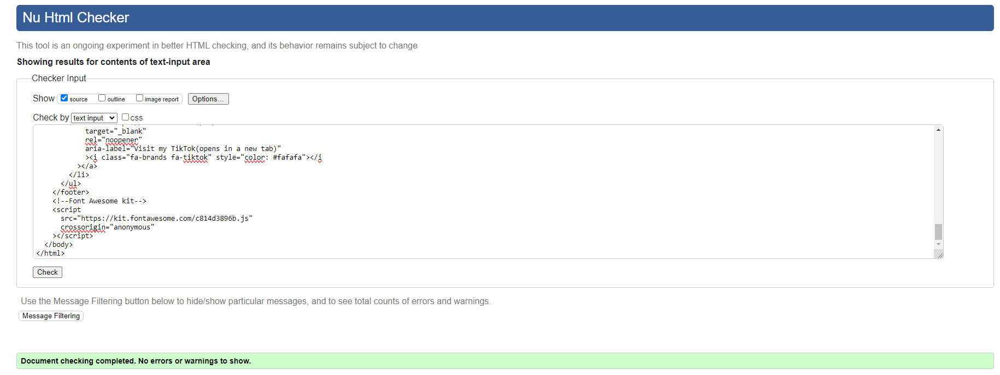

##### 404
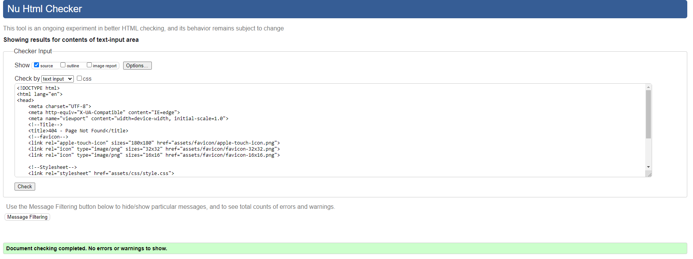

#### *CSS*
CSS Validation can only be done by copying and pasting the CSS file contents into the direct input.

- CSS - No errors or warnings.

##### CSS
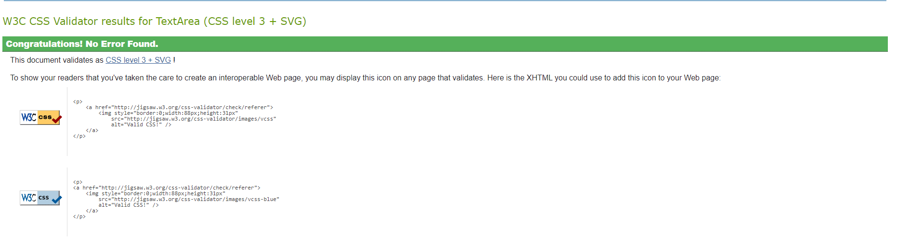

### Light house

Lighthouse was used which is found within the Chrome Developer Tools to allow me to test the performance, accessibility, best practices and SEO of the website.
my primary focus for this site was the accessibility.

##### Index
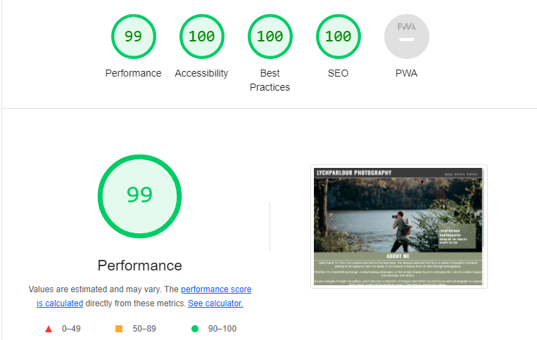

##### Gallery
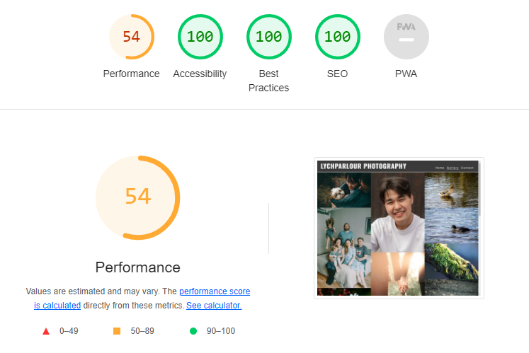

##### Contact
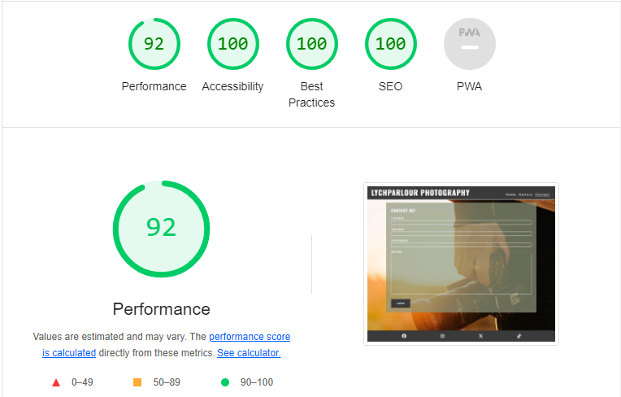

##### Thank You
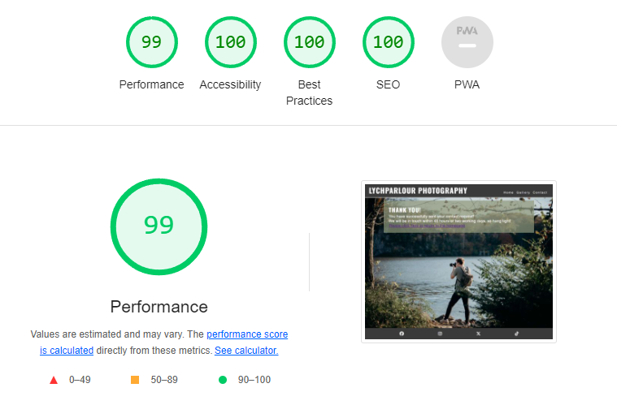

### WAVE

As accessibility was one of my main focuses for this website I also used WAVE testing.
WAVE is a suite of evaluation tools that helps authors make their web content more accessible to individuals with disabilities.

##### Index
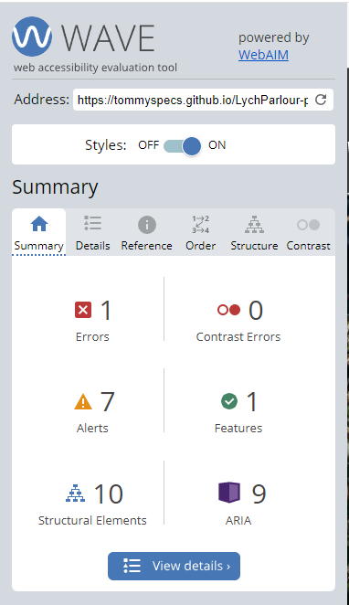

##### Gallery
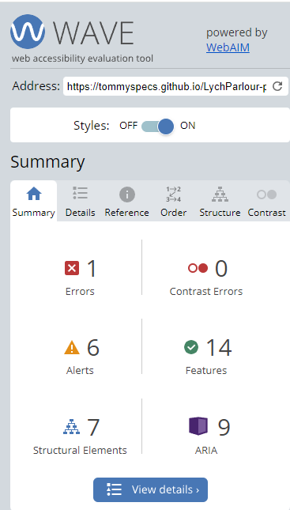

##### Contact
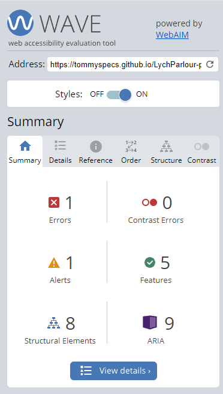

##### Thank You
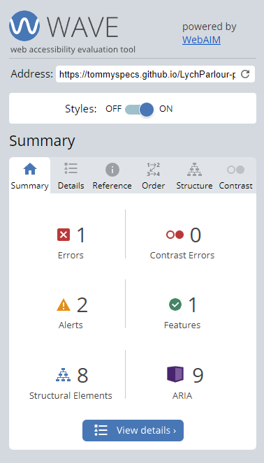

 ---

## Manual testing

Some of the website functions need to be tested manually, such as links around the page or the functionality and responsivness of added features. 

### Devices Used

| Device  | Name/ Size of Sevice| 
|---------|---------------|
| Desktop | 1920 x 1080 |
| Laptop  | 1366 x 768 |
| Tablet | Apple iPad Pro |
| Mobile | Apple iPhone 13 Pro Max 128GB |

### Browsers Used
Google Chrome
Safari

#### Desktop (1920 x 1080)
#### Browser (Google Chrome)

| Feature         | Expected Outcome                                              | Testing Performed  | Result                    | Pass/Fail |
| ----------------| --------------------------------------------------------------| ------------------ | --------------------------| --------- |
|Logo home page link | When clicked the user is be redirected to the home page  | Clicked Logo |When clicked the user is be redirected to the home page | Pass |
| Navbar          |                                                               |                    |                           |           |
| Home Page Link | When clicked the user is be redirected to the home page | Clicked link |When clicked the user is be redirected to the home page | Pass |
| Gallery Link | When clicked the user is be redirected to the gallery page | Clicked link       |When clicked the user is be redirected to the gallery page | Pass |
| Contact Link | When clicked the user is redirected to the contact page | Clicked link |When clicked the user is redirected to the contact page | Pass |
| Footer          |                                                               |                    |                           |           |
| Social Icons | When clicked the user is redirected to the associated page in a new tab | Clicked link | When clicked the user is redirected to the associated page in a new tab | Pass |
| Gallery | Responsive and interactive zoom feature | Hoverd over | Responsive and interactive zoom feature | Pass |
|Contact Page     |                                                               |                    |                           |           |
| First name input| Input required to submit form | Entered text | Input required to submit form | Pass |
| Last name input | Input required to submit form | Entered text | Input required to submit form | Pass |
| Email Input     | Input required to submit form | Entered text | Input required to submit form | Pass |
|Text area input  | Input required to submit form | Entered text | Input required to submit form | Pass |
| Form | Form directs to Thank you page | Click submit button| Form directs to Thank you page | Pass |
| Return home link| Redirected to homepage | Clicked link | Redirected to homepage | Pass |
| Error-404       |                                                               |                    |                           |           |
| Return home link| Redirected to homepage | Clicked link       | Redirected to homepage | Pass |

#### Laptop (1366 x 768)
#### Browser (Google Chrome)
| Feature         | Expected Outcome                                              | Testing Performed  | Result                    | Pass/Fail |
| ----------------| --------------------------------------------------------------| ------------------ | --------------------------| --------- |
|Logo home page link | When clicked the user is be redirected to the home page  | Clicked Logo |When clicked the user is be redirected to the home page | Pass |
| Navbar          |                                                               |                    |                           |           |
| Home Page Link | When clicked the user is be redirected to the home page | Clicked link |When clicked the user is be redirected to the home page | Pass |
| Gallery Link | When clicked the user is be redirected to the gallery page | Clicked link       |When clicked the user is be redirected to the gallery page | Pass |
| Contact Link | When clicked the user is redirected to the contact page | Clicked link |When clicked the user is redirected to the contact page | Pass |
| Footer          |                                                               |                    |                           |           |
| Social Icons | When clicked the user is redirected to the associated page in a new tab | Clicked link | When clicked the user is redirected to the associated page in a new tab | Pass |
| Gallery | Responsive and interactive zoom feature | Hoverd over | Responsive and interactive zoom feature | Pass |
|Contact Page     |                                                               |                    |                           |           |
| First name input| Input required to submit form | Entered text | Input required to submit form | Pass |
| Last name input | Input required to submit form | Entered text | Input required to submit form | Pass |
| Email Input     | Input required to submit form | Entered text | Input required to submit form | Pass |
|Text area input  | Input required to submit form | Entered text | Input required to submit form | Pass |
| Form | Form directs to Thank you page | Click submit button| Form directs to Thank you page | Pass |
| Return home link| Redirected to homepage | Clicked link | Redirected to homepage | Pass |
| Error-404       |                                                               |                    |                           |           |
| Return home link| Redirected to homepage | Clicked link       | Redirected to homepage | Pass |

#### Tablet (Apple iPad Pro)
#### Browser (Safari)
| Feature         | Expected Outcome                                              | Testing Performed  | Result                    | Pass/Fail |
| ----------------| --------------------------------------------------------------| ------------------ | --------------------------| --------- |
|Logo home page link | When clicked the user is be redirected to the home page  | Clicked Logo |When clicked the user is be redirected to the home page | Pass |
| Navbar          |                                                               |                    |                           |           |
| Home Page Link | When clicked the user is be redirected to the home page | Clicked link |When clicked the user is be redirected to the home page | Pass |
| Gallery Link | When clicked the user is be redirected to the gallery page | Clicked link       |When clicked the user is be redirected to the gallery page | Pass |
| Contact Link | When clicked the user is redirected to the contact page | Clicked link |When clicked the user is redirected to the contact page | Pass |
| Footer          |                                                               |                    |                           |           |
| Social Icons | When clicked the user is redirected to the associated page in a new tab | Clicked link | When clicked the user is redirected to the associated page in a new tab | Pass |
| Gallery | Responsive and interactive zoom feature | Hoverd over | Responsive and interactive zoom feature | Pass |
|Contact Page     |                                                               |                    |                           |           |
| First name input| Input required to submit form | Entered text | Input required to submit form | Pass |
| Last name input | Input required to submit form | Entered text | Input required to submit form | Pass |
| Email Input     | Input required to submit form | Entered text | Input required to submit form | Pass |
|Text area input  | Input required to submit form | Entered text | Input required to submit form | Pass |
| Form | Form directs to Thank you page | Click submit button| Form directs to Thank you page | Pass |
| Return home link| Redirected to homepage | Clicked link | Redirected to homepage | Pass |
| Error-404       |                                                               |                    |                           |           |
| Return home link| Redirected to homepage | Clicked link       | Redirected to homepage | Pass |

#### Mobile (Apple iPhone 13 Pro Max 128GB)
#### Browser (Safari) 
| Feature         | Expected Outcome                                              | Testing Performed  | Result                    | Pass/Fail |
| ----------------| --------------------------------------------------------------| ------------------ | --------------------------| --------- |
|Logo home page link | When clicked the user is be redirected to the home page  | Clicked Logo |When clicked the user is be redirected to the home page | Pass |
| Navbar          |                                                               |                    |                           |           |
| Home Page Link | When clicked the user is be redirected to the home page | Clicked link |When clicked the user is be redirected to the home page | Pass |
| Gallery Link | When clicked the user is be redirected to the gallery page | Clicked link       |When clicked the user is be redirected to the gallery page | Pass |
| Contact Link | When clicked the user is redirected to the contact page | Clicked link |When clicked the user is redirected to the contact page | Pass |
| Footer          |                                                               |                    |                           |           |
| Social Icons | When clicked the user is redirected to the associated page in a new tab | Clicked link | When clicked the user is redirected to the associated page in a new tab | Pass |
| Gallery | Responsive and interactive zoom feature | Hoverd over | Responsive and interactive zoom feature | Pass |
|Contact Page     |                                                               |                    |                           |           |
| First name input| Input required to submit form | Entered text | Input required to submit form | Pass |
| Last name input | Input required to submit form | Entered text | Input required to submit form | Pass |
| Email Input     | Input required to submit form | Entered text | Input required to submit form | Pass |
|Text area input  | Input required to submit form | Entered text | Input required to submit form | Pass |
| Form | Form directs to Thank you page | Click submit button| Form directs to Thank you page | Pass |
| Return home link| Redirected to homepage | Clicked link | Redirected to homepage | Pass |
| Error-404       |                                                               |                    |                           |           |
| Return home link| Redirected to homepage | Clicked link       | Redirected to homepage | Pass |

---
### Bugs

#### Fixed Bugs

|               Bug               |                How I fixed it                      |
|---------------------------------|----------------------------------------------------|     
|Sizing the Call to Action images | set heights and media queries for each screen size |
|The text box in contact page cursor was starting from the center of the box | remove the txt box and impliment a text area| 

#### Known bugs
- The alignment of the images in the gallery, I have attempoted add more images of various sizes to fill the gaps to little success.
- he perfomrance on the Gallery page is not great, I had tried to convert the format and compress the images but this had minimal impact.